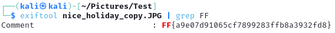

# CTF Steganography-Challenge | Behind the Pixels Writeup: Easy Level
## Challenge Overview
In this challenge, we were tasked to find the flag within a picture. Use basic forensic tools to find your way to the flag.
## Steps to Solve
1. **Set up your environment**
    - To begin, ensure you have access to a Linux environment (like Kali Linux) or a system where ExifTool is installed. ExifTool is a widely used utility for reading and editing metadata within image files, making it ideal for identifying hidden information.

2. **Inspect Metadata with ExifTool**
    - ExifTool allows you to analyze various metadata attributes embedded within the image file. Execute the following command to examine the file's metadata:
     `exiftool [filename.jpg]`

3. **Locate the flag**
    - Once ExifTool displays the metadata, closely examine each field, particularly any fields that appear unusual or hold unexpected content. Look for a field labeled Comment, as this is where the flag is hidden.
    

## Tools Used
- ExifTool: Acomprehensive tool for viewing and editing metadata within files.

## Conclusion
This challenge provides an excellent introduction to forensic analysis and steganography. By using ExifTool to inspect metadata, participants learn a foundational skill in digital forensics. 
This approach demonstrates the importance of understanding file properties and metadata, emphasizing how hidden data can be retrieved with the right tools and techniques.