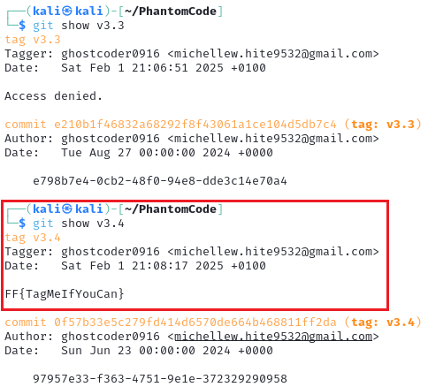

# CTF OSINT-Challenge | Git Secrets: Layers of Discovery Writeup: Medium Level

## Challenge Overview

The infamous PhantomCoer0916 has been hiding encrypted messages in their Git repository, PhantomCode. Your mission is to track down and uncover these secrets before they disappear forever. Each clue brings you closer to understanding what PhantomCoer0916 is up to.

## Requirements

To complete this challenge, the following tools and knowledge are necessary:

- **Git Installed**: Basic Git commands need to be executed in a terminal.
- **Repository Access**: The challenge repository should be cloned locally using `git clone https://github.com/ghostcoder0916/PhantomCode.git`.
- **Terminal Access**: A Unix-based terminal (Linux/Mac) or Git Bash (Windows) for executing commands.

## Steps to Solve

### Part 1 - Commit Message

A strange commit appeared in the PhantomCode repository. Rumors say it contains a secret message, but it's buried among countless fake commits. Can you find what PhantomCoer0916 was trying to communicate?

> [!TIP]
> Search commit messages carefully—one of them hides the truth.

- The first flag is hidden inside a commit message. To find it, search commit messages for the flag pattern:

```bash
git log --grep=FF{
```
- The command filters the commit history and displays only messages containing `FF{`, revealing the flag.
 

### Part 2 - Deleted File

A crucial file once existed in the repository but was mysteriously deleted. What was in it? Why did PhantomCoer0916 erase it? Your task is to retrieve what was lost before it's gone for good.

> [!TIP]
> Look through the commit history to find traces of the missing file.

- Check the commit history for deleted files.
```bash
git log --diff-filter=D --summary
```
- Identify the deleted file's name and note its hash.
 
- Going to the repository online, you can search for the hash and have a look at the deleted file.
 
- If have a look at the commit before this one you don't have to decrypt the message by yourself.
 

### Part 3 - Git Tag

Not all secrets are erased—some are cleverly hidden in plain sight. PhantomCoer0916 has been marking important milestones in the repository, but one of these marks conceals something unusual. Can you find the hidden message?

> [!TIP]
> Examine the tags carefully. One of them contains a secret.

- List all tags in the repository. 
```bash
git tag
```
 
- Inspect each tag's message using:
```bash
git show v1.0
git show v1.1
...
...
```
- One of these tag messages contains the flag.
 

### Part 4 - Fake Account

Someone has been tampering with the repository—an unknown user who shouldn’t have access. But who is it? PhantomCoer0916 may have created a fake identity to cover their tracks. Find the imposter and expose their email address to uncover the final piece of the puzzle.

> [!TIP]
> Investigate the commit authors. One of them doesn’t belong.

- Display a list of contributors.
```bash
git shortlog -s -n
```
- Identify any suspicious or unknown commit authors.
 
- View commits made by a specific author to get the email address of the fake user.
 
- Submit the extracted email address as the flag.

## Conclusion

This challenge required exploring various aspects of Git, including commit messages, deleted files, tags, and user metadata. By systematically applying Git commands, all hidden flags could be uncovered. These techniques are useful for real-world digital forensics and security investigations in Git repositories.