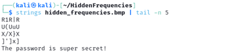
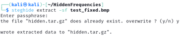
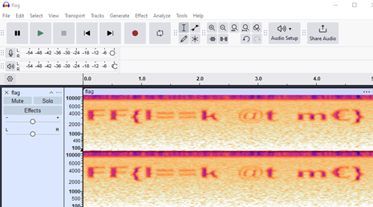

# CTF Stegonography-Challenge | Hidden Frequencies Writeup: Medium Level

## Challenge Overview

In this challenge, we are given an image file that contains hidden data. The goal is to extract the hidden file, analyze its contents, and retrieve the flag.

## Steps to Solve

**1. Find the Password**

  - When attempting to extract data using steghide, we are prompted for a passphrase. Since no password is provided, we need to find it within the file itself.
  
  - After running this command, we find the password needed for steghide.

    

**2. Extracting the Hidden File**

  - Now that we have the password, we can use steghide to extract the hidden file. This will extract a compressed archive (.tar.gz).

    

  - Extract the archive:

    `tar -xvzf hidden.tar.gz`

**3. Analysing the Audio File**

  - Since the challenge name suggests something related to frequencies, we should inspect the spectrogram of the audio file.
  - Open the audio file in Audacity, click on the track name and select Spectrogram View. The flag will be displayed within the frequency spectrum

    

## Conclusion

This challenge combined steganography (Steghide), forensics (strings analysis), and audio analysis (spectrogram) to hide and reveal the flag. Players needed to think outside the box and explore multiple data-hiding techniques.
