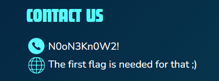
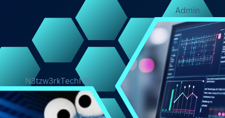

# CTF Web-Challenge/Reversing | Hidden Job Writeup: Medium Level

## Challenge Overview
The HiddenJob challenge combines competences of physical awareness, web as well as reverse engineering. The introduction is given by a flyer that must be found before the (real) fun begins. There is also game that can be played in the course of this challenge as well.

Just some basic steps must be done in order to find all flags.

## Steps to solve
1. **Find and analyse the HiddenJob flyer**:
    - The first step was to find the HiddenJob flyer which was placed on the well-known flyer board near the canteen.
    - This also leads to the first flag (static): ``FF{N0oN3Kn0W2!}``

    

2. **Credentials Hunter**:
    - On the mentioned flyer, credentials for the next steps can be found as well.

    `Username: Admin`
    `Password: N3tzw3rkTechNik`

    

3. **Login**:
    - Use the credentials from step 2 to login on the HiddenJob website.

4. **Find the second flag**:
    - After the login, open one of the recent jobs again.
    - You will gather the second flag (dynamic) through this step.

5. **Find robots.txt**:
    - Using the hints from the website, it is clear that the flag from step 4 must be reused for the robots.txt URL.
    - The URL is `<flag>/robots.txt`
    - There is also a hint for the last flag.

6. **Play ProjectDelta**:
    - The last flag may be obtained by playing ProjectDelta - download it from `/download/ProjectDelta.zip`.
    - The final boss of the game must be killed in order to get the last flag.
    - Go to the bottom right-hand edge of the map and cross the bridge there. Then continue to the right until you pass the 2nd house there should be a path leading down. This path will take you to the final boss via an invisible teleporter. Happy killing!
    - Static flag: `FF{Proj3ctD3ltA!sTh3B4st@ame!}` 

## Tools Used
- Webtools
- URL Hopping

## Conclusion
HiddenJob was a good introduction to recognising that it is worth analysing existing things more closely. In addition, basic URL hopping could be carried out and a short break could be taken for gaming.