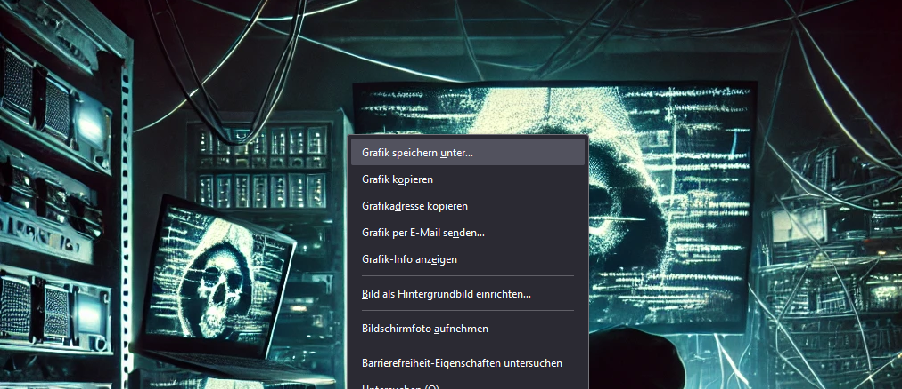
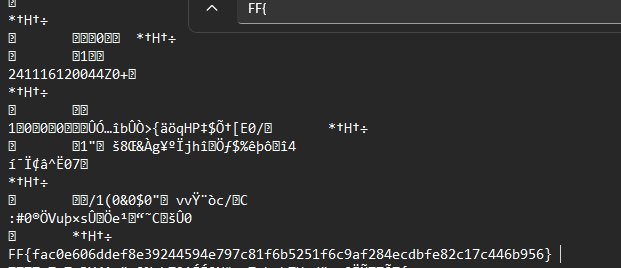

# CTF Web-Challenge | Pixel:_Spy Writeup: Easy (Junior)

## Challenge Overview

- This challenge was created for junior hackers. They need to use Notepad or web tools to find the flag in the image data.

## Steps to Solve

1. **Download the file from the webpage**:

2. **Use notepad to open the file**

- Using Notepad, you can view the image data. Use the search function (Ctrl + F) and look for the flag format to locate it within the data.

