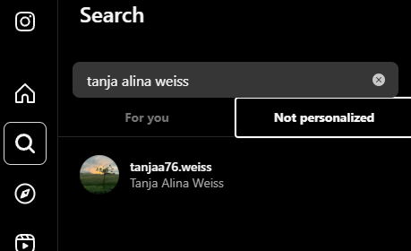
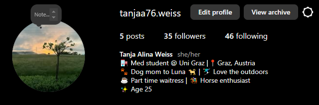

# CTF OSINT-Challenge | Profile Prodigy: Easy Level

## Challenge Overview

    Tanja Weiss is a med student, who likes to travel and go skiing. Your goal is to find the hidden flags in her Instagram profile.

## Steps to Solve

### Part 1

**1. Account**

  - As the name of this person is known, a simple search on Instagram gets us her account.
    

**2. Post**

  - Looking through her posts, a image with a tag is found. The tag is the flag and also formatted like one.

### Part 2

**1. Caption**

  - When looking through the captions of her posts, it gets clear that her favourite place to visit is Budapest.

### Part 3

**1. Connect the dots**

  - Looking at her username we can see the number 76. When thinking about it, a lot of people use their birthday in their username and Tanja did so too. With this we have the day and the month. The only thing that is missing is the year and this we can get by doing the math because she states in her caption how old she is.
  

## Conclusion

Sometimes a little bit of research can lead to a lot of information of a person.