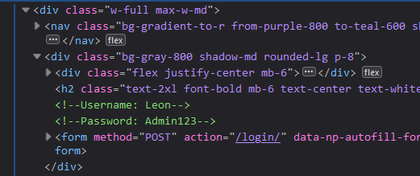
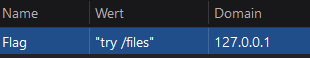
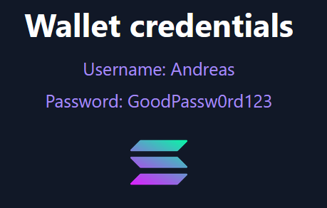
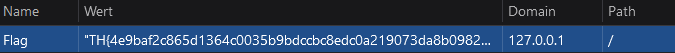

# CTF Web-Challenge | Solana Assests Writeup: Easy Level

## Challenge Overview

In this challenge, we were tasked with solving a basic web flag hunt. Use basic knowledge to find your way to the flag

## Steps to Solve

1. **Use Webtools to find the first credentials**:

   - The first step was to find commented credentials in the html file, use the credentials, this will redirect you to the next page.

   `Username: Leon`
   `Password: Admin123`

   

2. **Determine the cookie**:

   - Next, we needed to use the web tools again but now we have to read the content of a cookie.
     `/files`

   

3. **Get new credentials**:

   - On the `/files` you should see a new pair of credentials. Use them to enter the crypto dashboard.

   

4. **Finally get the real flag**

   - In the final stage you need to read the cookie content and enter the flag on the web application

   

## Tools Used

- Webtools

## Conclusion

This challenge was a great introduction to basic web attacks, we used simple logic to enter the dashboard and get the cookie.
