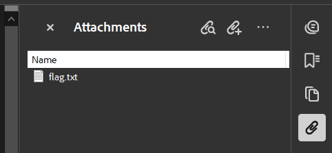

# CTF Forensics | Stealth Invoice Writeup: Medium Level

## Challenge Overview
In the "Stealth Invoice" challenge, participants must analyze a seemingly normal invoice PDF to uncover hidden information. The challenge involves finding and decoding secret messages embedded within the document.

## Steps to solve
1. **Find the hidden text**:
    - Navigate to the root (/) of the flask app. 
    - The first flag cannot be found behind the black box (just a bait ;3).
    - Have a look on the bottom of the file - the flag is hidden by using a white font color.

2. **Download the PDF**:
    - Download the PDF for further investigations.

3. **Extract the embedded file**:
    - Use a PDF editor that can also display embedded files, e.g. Adobe Acrobat.
    - In Adobe Acrobat navigate to `Attachments` in the right toolbar.
    - Open the `flag.txt`

    

4. **Decode the flag**:
    - The content of the `flag.txt` was encoded using caesar cipher and base64.
    - In order to gather the flag we must decode it in two ways:
        - Decode Base64
        - Decode Caesar cipher (Shift: 5)
        - The flag is now shown in the already known schema `FF{...}`

## Tools Used
- Adobe Acrobat (or any other PDF Viewer with extended features)

## Conclusion
StealthInvoice was a good introduction to understand, that censoring information incorrectly may lead to possible data leaks. Furthermore, we learnt that additional files can be embedded into a PDF file.