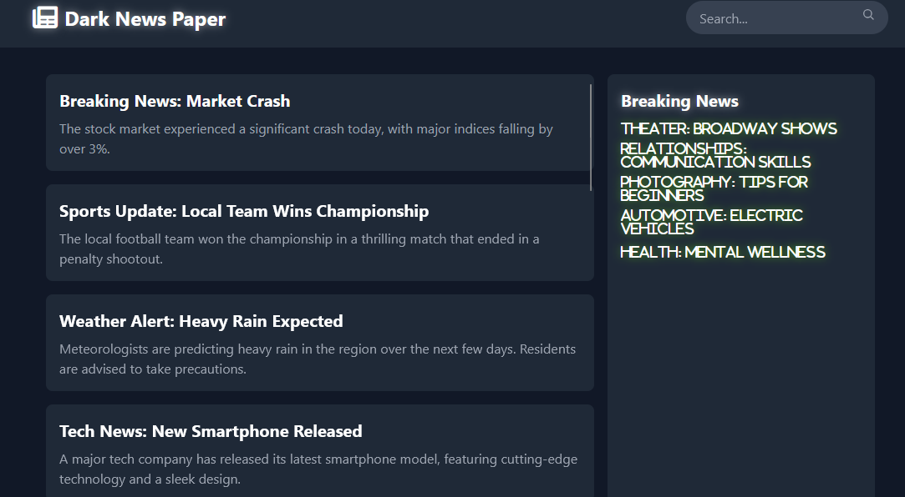

# CTF Web-Challenge | Solana Assets Writeup: Easy Level

## Challenge Overview
In this challenge, the attacker needs to exploit a vulnerability in the website's search functionality to retrieve a hidden flag. This challenge tests basic SQL injection techniques and understanding of how poorly sanitized input fields can be used for exploitation.

## Steps to Solve

1. **Explore the Web Page**

    - Begin by accessing the challenge page and examining its features to identify potential vulnerabilities. In this case, a search function is available, which may be vulnerable to injection attacks.
    - The attacker investigates the search box by inputting various entries to see how the application responds. This kind of exploration often reveals clues about potential weaknesses in how input data is processed.
    
    

2. **Exploit the Search Function**

    - After analyzing the page, the attacker attempts a **SQL injection** attack on the search function to access the flag. SQL injection involves inserting specially crafted SQL commands into input fields, exploiting the lack of proper input sanitization.
    - The attacker uses the following SQL injection payload in the search box:
      
      ```sql
      flag' OR '1'='1' --
      ```
      
      - **Explanation**: This payload works by ending the initial SQL query string, injecting a true statement (`'1'='1'`), and then commenting out the rest of the query using `--`. This effectively bypasses the usual logic of the search query, causing it to return more results than intended, including the hidden flag.
    - After entering the payload, the flag is revealed as a red popup notification in the bottom-right corner of the page.

3. **Retrieve the Flag**

    - The attacker notes down the flag displayed in the popup and successfully completes the challenge.
    
    

## Tools Used

- **SQL Injection Basics**: Understanding basic SQL commands and techniques, especially SQL injection, is essential for solving this challenge.

## Conclusion

This challenge demonstrates how a simple input vulnerability in a search function can lead to unintended access to sensitive data. By exploiting SQL injection, the attacker was able to bypass the search logic and retrieve the flag, highlighting the importance of secure coding practices and input validation. Ensuring that all inputs are sanitized and using prepared statements can help prevent such vulnerabilities in real-world applications.

