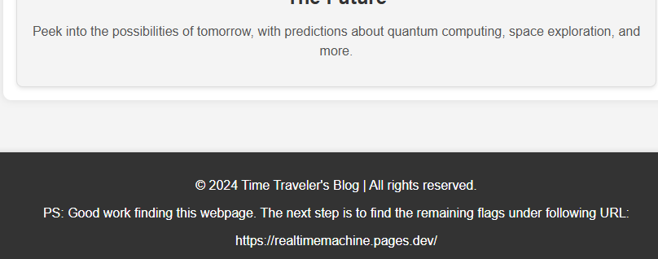
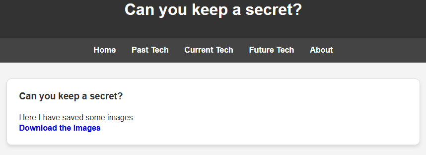

# CTF OSINT-Challenge | Time Traveler's Hunt Writeup: Easy to Medium Level

## Challenge Overview

In this challenge a broken link to an old website, that no longer exists, is provided. Participants must use the Wayback Machine or another archival tool to retrieve a past snapshot of the website www.faketimemachine.rf.gd, where a hint to the real website is hidden. This challenge is split into three parts.

## Steps to Solve

### Part 1

**1. Find snapshot**

  - Go to `archive.org` and search for the provided URL. As one can see there are some captures.
  - Look through them and you can see at the bottom of the page a URL, that says `... realtimemachine. ...`.

    

  - Test all links that are provided and as soon as you find one that works you have passed the first "test".

    

  - In one of the captures the first flag is hidden, but you can get it also on the functional website. Inspect the page source and the flag will be found.

    

**2. Search through Website**

  - Another way to find the first flag is to search through the page source of all blogs. In the blog called `AI-Powered Assistants: The Future of Personal Productivity` the flag is hidden in the same manner.

    

**3. Decrypting Flag**

  - After trying some different combinations in [CyberChef](https://gchq.github.io/CyberChef/) you can see that base64 and hex was used to encrypt the flag.

    

### Part 2

**1. Secret Blog**

  - To find a hidden file one has to use `dirbuster`. In this part the goal is to find this hidden file and have a look at the message in it.

    

  - As shown above the secretblog.html suddenly appears. When visiting this page following clue gets displayed:

    

**2. Solving a Puzzle**

  - After downloading the images, they have to be put together like this:

    

  - After scanning the QR-code a text will appear. It looks like a flag but the text inside FF{} is encrypted.

  - Next thing to do is to try  to let hashcat run over it. Like this the password was cracked rather fast.

    

### Part 3

**1. Secret File**

  - When going through the blogs again, a difference can be spotted:

    

  - With this link a PDF file can be downloaded. The goal is to get the right password to the file. Inside that file, the flag is hidden.

**2. Crack Password**

  - To crack the file get the hash of the file with pdf2john.

    

  - Afterwards run JohnTheRipper with a wordlist your choice. I used rockyou.txt:

    

  - Use it to open the PDF file. 

**3. Find the Flag**

  - In the file there are a lot of random letters, numbers and symbols. To find the flag Strg + F is used.

    ]

## Tools used

  - archive.org
  - Kali Linux
  - JohnTheRipper
  - dirbuster
  - Photoshop
  - CyberChef

## Conclusion

In this challenge the participant has to use various tools to get to the goal. It is important to know them, because they're a must in the IT.