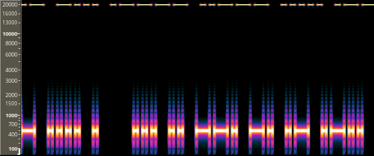
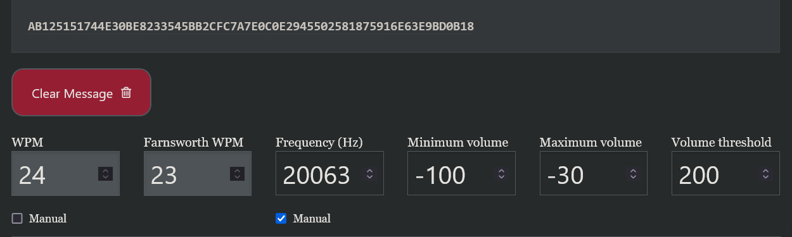

# CTF-Challange | Phantom Frequency writeup: Level Medium 
> _This challenge is called `Phantom Frequency`, but you may also see it referred to as it's working name `morse` in some places._

## Challange Overview
In this challange the user is provided a compiled python script and a flag file, the goal is it to decompile the provided script, find out how the flag is stored and write a script to reverse this process and extract the flag from it's file

## Steps to Solve

1. **Find out about the hidden Frequency**\
Listening to the `intercepted.wav` file sounds like a standard morse code, decoded it reads _Some truths whisper, barely a breath above silence. Only those who listen beyond the range of hearing will find the key._, which hints at a low Volume somwhere where you can't hear. Looking at the spectogram of the file, using a programm like Audacity, reveales something on the 20kHz frequency:\

2. **Decode the Hidden Flag** \
Using the [Morse Code Adaptive Decoder from morsecode.world](https://morsecode.world/international/decoder/audio-decoder-adaptive.html), we can set the frequency and minimum Volume manually, to select the hidden Frequency. Morsecode.world will slightly change the Frequency, but it still close enough to work:\

3. **Insert into Flag Format**\
Since Morse Code does not support the brackets used to enclose the flag you will hafe to manually add these and the FF prefix.
`AB125151744E30BE8233545BB2CFC7A7E0C0E2945502581875916E63E9BD0B18` becomes the Flag 
`FF{AB125151744E30BE8233545BB2CFC7A7E0C0E2945502581875916E63E9BD0B18}`

