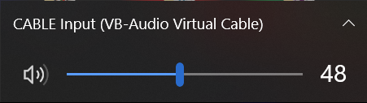
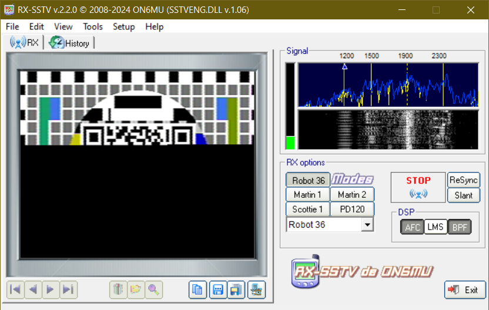
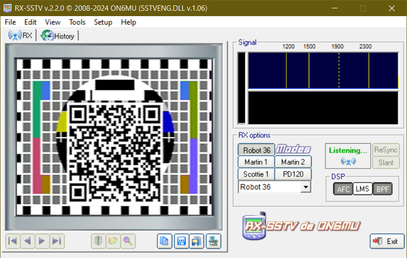
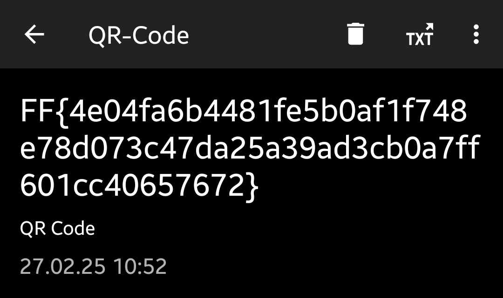

# CTF-Challenge | Transmission Received writeup: Level Hard

## Challenge Overview

You receive a WAV audio file containing a mysterious transmission. The signal appears to be an SSTV (Slow Scan Television) transmission. Your goal is to decode the SSTV image, which contains a QR code. Scanning the QR code will reveal the flag.

## Steps to Solve

1. **Identify the Type of Signal**
  There are multiple ways to go about finding out what the signal actually is. You should cfind out, that this is a [Slow Scan Television](https://en.wikipedia.org/wiki/Slow-scan_television) (SSTV) signal.

2. **Decoding SSTV**\
  There are multiple options for software to choose from, like [RX-SSTV](https://www.qsl.net/on6mu/rxsstv.htm) and [MMSSTV](https://hamsoft.ca/pages/mmsstv.php) for Windows and [QSSTV](https://github.com/ON4QZ/QSSTV) for Linux.\
  Install the decoder of your choice, dor both RX-SSTV and MMSSTV you will need to install the [VB Virtual Audio Cable](https://vb-audio.com/Cable/)
    1. Make sure to select `CABLE Input (VB-Audio Virtual Cable)` as your speaker device and that your microphone is not muted.\
      

    2. With RX-SSTV Running, play the audio. RX-SSTV automatically recognises the transmission and start decoding it.\
      

    3. After the transmission has finished you're presented with the decoded image.\
      

3. **Scan the QR-Code the get the flag**\
  Scanning the QR-Code reveales the flag.\
    